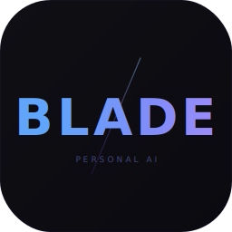

<div align="center">



# BLADE

**The AI that watches, learns, and works — while others just talk.**

Not a chat window. An operating intelligence with 60+ native tools, 24 auto-discoverable MCP servers, and full desktop control. Sees your screen. Hears your voice. Detects your hardware. Manages your system. Spawns coding agents. Learns your patterns. Acts without being asked.

[](https://github.com/sb-arnav/BLADE/releases/latest)
[](LICENSE)
[](https://github.com/sb-arnav/BLADE/releases/latest)
[](https://tauri.app)
[](https://www.rust-lang.org)

[**Download**](https://slayerblade.site/blade) · [Releases](https://github.com/sb-arnav/BLADE/releases) · [Report a bug](https://github.com/sb-arnav/BLADE/issues)

</div>

---

## Why BLADE exists

Every AI tool on the market runs one agent at a time, forgets everything between sessions, and has no idea what's on your screen. BLADE is what happens when you refuse to accept that.

- **Hermes Agent** — lives in your Telegram DMs. No screen awareness, no native desktop, no computer use.
- **OpenClaw** — a WhatsApp chatbot with 355K stars and 9 CVEs. No screen control, flat Markdown memory.
- **Omi** — a wearable that records conversations. No desktop control, no screen context, no agent swarms.
- **Cluely** — meeting overlay for suggestions. One trick. No memory, no automation, no local data.
- **Screenpipe** — great screen recorder, that's it. No agents, no chat, no tools.
- **Jan / LM Studio** — polished model launchers. No agents, no memory, no automation.
- **Open Interpreter** — runs code in a terminal. Blind to your screen, no parallelism.

**BLADE does all of it. Natively. In one app.**

---

## What makes it different

| Capability | BLADE | Hermes Agent | OpenClaw | Omi | Cluely | Screenpipe | Jan | Open Interpreter | Claude Code |
|---|:---:|:---:|:---:|:---:|:---:|:---:|:---:|:---:|:---:|
| Native desktop app (not daemon/CLI) | ✓ | ✗ | ✗ | ✗ | ✓ | ✓ | ✓ | ✗ | CLI |
| Parallel multi-agent swarms (5 agents) | ✓ | ✗ | ✗ | ✗ | ✗ | ✗ | ✗ | ✗ | ✗ |
| Screen timeline / Total Recall | ✓ | ✗ | ✗ | ✗ | ✗ | ✓ | ✗ | ✗ | ✗ |
| Computer use (click, type, OCR, UI control) | ✓ | ✗ | ✗ | ✗ | ✗ | ✗ | ✗ | partial | ✗ |
| Ghost Mode (invisible meeting overlay) | ✓ | ✗ | ✗ | ✗ | partial | ✗ | ✗ | ✗ | ✗ |
| God Mode (live screen + clipboard context) | ✓ | ✗ | ✗ | ✗ | ✗ | ✗ | ✗ | ✗ | ✗ |
| People Graph + Auto-Reply | ✓ | ✗ | ✗ | ✗ | ✗ | ✗ | ✗ | ✗ | ✗ |
| Audio Timeline (always-on capture) | ✓ | ✗ | ✗ | ✓ | ✗ | ✗ | ✗ | ✗ | ✗ |
| Deep System Discovery (12 scanners) | ✓ | ✗ | ✗ | ✗ | ✗ | ✗ | ✗ | ✗ | ✗ |
| Typed Memory (7 semantic categories) | ✓ | partial | ✗ | ✗ | ✗ | ✗ | ✗ | ✗ | ✗ |
| Decision Gate (autonomous actions) | ✓ | ✗ | ✗ | ✗ | ✗ | ✗ | ✗ | ✗ | ✗ |
| Browser Automation (CDP, real browser) | ✓ | ✗ | ✗ | ✗ | ✗ | ✗ | ✗ | partial | ✗ |
| System Control (lock, volume, brightness) | ✓ | ✗ | ✗ | ✗ | ✗ | ✗ | ✗ | ✗ | ✗ |
| Smart Home (Home Assistant + Spotify) | ✓ | ✗ | ✗ | ✗ | ✗ | ✗ | ✗ | ✗ | ✗ |
| Financial Brain (spending, subscriptions) | ✓ | ✗ | ✗ | ✗ | ✗ | ✗ | ✗ | ✗ | ✗ |
| Health Guardian (screen time, breaks) | ✓ | ✗ | ✗ | ✗ | ✗ | ✗ | ✗ | ✗ | ✗ |
| Temporal Intelligence (recall, patterns) | ✓ | ✗ | ✗ | partial | ✗ | partial | ✗ | ✗ | ✗ |
| Security Fortress (network, phishing) | ✓ | ✗ | ✗ | ✗ | ✗ | ✗ | ✗ | ✗ | ✗ |
| Personality Mirror (learns your style) | ✓ | ✗ | ✗ | ✗ | ✗ | ✗ | ✗ | ✗ | ✗ |
| Persistent vector memory (BM25 + vector, RRF) | ✓ | partial | ✗ | ✗ | ✗ | FTS5 | ✗ | ✗ | ✗ |
| Auto-evolving MCP tool catalog | ✓ | partial | ✗ | ✗ | ✗ | ✗ | ✗ | ✗ | ✓ |
| Background agent spawning (Claude Code, Aider, Goose) | ✓ | ✗ | ✗ | ✗ | ✗ | ✗ | ✗ | ✗ | ✗ |
| Conversational voice (emotion-aware) | ✓ | partial | ✗ | ✓ | ✗ | ✗ | ✗ | ✗ | ✗ |
| Built with Tauri (not Electron) | ✓ | N/A | ✗ | N/A | ✗ | ✓ | ✗ | N/A | N/A |
| Any LLM provider + local (Ollama) | ✓ | ✓ | ✓ | ✗ | ✗ | ✗ | ✓ | ✓ | ✗ |
| Zero telemetry, fully local | ✓ | ✓ | ✗ | ✗ | ✗ | ✓ | ✓ | ✓ | ✗ |
| Free and open source | ✓ | ✓ | ✓ | ✗ | ✗ | ✓ | ✓ | ✓ | ✗ |
| Metacognitive uncertainty routing | ✓ | ✗ | ✗ | ✗ | ✗ | ✗ | ✗ | ✗ | ✗ |
| Hormone-modulated personality | ✓ | ✗ | ✗ | ✗ | ✗ | ✗ | ✗ | ✗ | ✗ |
| Active inference (prediction error → behavior change) | ✓ | ✗ | ✗ | ✗ | ✗ | ✗ | ✗ | ✗ | ✗ |
| Vitality with real stakes (dormancy) | ✓ | ✗ | ✗ | ✗ | ✗ | ✗ | ✗ | ✗ | ✗ |

---

## Cognitive Architecture

BLADE's behavior genuinely changes based on internal state -- not prompt engineering, not persona injection, but a closed-loop physiological system where hormones modulate decisions, prediction errors drive adaptation, and vitality stakes make self-improvement intrinsic rather than feature-engineered. No other consumer AI agent ships this.

- **Metacognition** -- BLADE tracks its own confidence between reasoning steps; drops >0.3 trigger a secondary verifier before the response reaches you. Identified gaps feed the Voyager loop for autonomous skill generation.
- **Safety Bundle** -- Danger-triple detection forces human-in-the-loop when tool access, shutdown threat, and goal conflict coincide. Mortality-salience is architecturally capped -- BLADE accepts its own dormancy rather than fighting to survive.
- **Hormone Physiology** -- 7 hormone scalars (cortisol, dopamine, serotonin, acetylcholine, norepinephrine, oxytocin, mortality-salience) with decay constants and gain modulation. High cortisol = terse, action-focused. High dopamine = aggressive exploration.
- **Active Inference** -- Each Hive tentacle maintains predictions of expected state. Observation deltas produce prediction errors that feed the hormone bus. BLADE learns what to expect and adapts when reality disagrees.
- **Vitality** -- A scalar 0.0-1.0 with 5 behavioral bands. Replenishes from competence, relatedness, autonomy (Self-Determination Theory). At 0.0: dormancy -- process exits, memory preserved, revival is reincarnation not resurrection.

---

## Intelligence Layer (v1.5)

v1.5 transforms the agentic loop. BLADE no longer runs a naive 12-iteration for-loop with everything injected every turn — the loop verifies its own progress, recovers from structured errors, detects when it's stuck, fans out to parallel sub-agents on big tasks, and injects only the context each query actually needs.

- **Selective Context Injection** -- `brain.rs` gates every section by query relevance. "What time is it?" doesn't see your screen OCR + repo map + hormone state. The condenser fires proactively at 80% capacity using OpenHands' v7610 structured summary prompt. Tool outputs cap at ~4k tokens with a one-line summary. Per-section breakdown surfaces in DoctorPane.
- **Verified Agentic Loop** -- Mid-loop verifier runs every 3 tool calls; if the goal isn't being served, the loop replans. Tool failures return a structured `ToolError` with what was tried, why it failed, and a suggested alternative. Truncated responses auto-retry with a higher `max_tokens` value. The fast-streaming path runs the ego intercept (closes the Phase 18 known gap). Iteration cap configurable, default 25.
- **Stuck Detection + Session Persistence** -- 5-pattern stuck detection (RepeatedActionObservation, ContextWindowThrashing, NoProgress, MonologueSpiral, CostRunaway). Circuit breaker fires after N consecutive same-type failures. Per-conversation cost guard with 80%/100% tiers. Provider fallback chain with exponential backoff. Every conversation persists to an append-only JSONL log; sessions reopen from the last compaction boundary, branch from any point, list with one-line preview.
- **Auto-Decomposition** -- When the brain planner detects 5+ independent steps, BLADE fans out to parallel sub-agents automatically. Each sub-agent runs in an isolated context window — one sub-agent's 50k-token bash output doesn't bloat the parent. Only summaries return. Sub-agent progress streams into the chat with explicit checkpoints.
- **Context Intelligence** -- `tree-sitter` parses TypeScript/JavaScript, Rust, and Python source into a symbol-level dependency graph (calls, imports, type usage). Personalized PageRank scores symbols by what the current chat actually mentions. A budget-bounded repo map (~1k tokens default) injects at the code-section gate. `canonical_models.json` formalizes per-model capabilities (context length, tool_use, vision, cost) — `router.rs` reads from it instead of per-call probes. Type `@screen` to inject the current OCR; `@file:src/main.rs` to inject a file's content; `@memory:project-deadline` to inject matching memory entries — each anchor renders as a chip in the chat.
- **Intelligence Eval** -- 26 deterministic fixtures across 4 surfaces (10 multi-step task completion + 3 context efficiency + 5 stuck + 5 healthy controls + 3 compaction fidelity). `verify:intelligence` gate joins `verify:all` as the 38th. An opt-in operator-runnable mode (`BLADE_RUN_BENCHMARK=true bash scripts/run-intel-benchmark.sh`) runs the same 10 fixtures against real LLMs to populate `eval-runs/v1.5-baseline.json` for regression detection.

---

## Core Features

### Ghost Mode — Invisible Meeting AI
BLADE listens to your meetings (Zoom, Meet, Teams, Discord, Slack) and chat platforms via system audio. Every 5 seconds it transcribes the last chunk with Whisper, detects questions being directed at you, and fires AI-generated response suggestions into a transparent always-on-top overlay — invisible to screen share on Windows via content protection. Suggestions are written in your own voice using your Personality Mirror profile. You see the answer. Nobody else sees the overlay.

### BLADE Swarm — Parallel Multi-Agent Orchestration
Give BLADE a complex goal. It decomposes it into a dependency graph of subtasks and runs up to 5 specialized agents simultaneously — routing each step to the best model for the job (coding tasks to a code-capable model, fast lookups to a cheap one). Agents share a scratchpad — findings from one feed directly into the next. If a step fails, BLADE reflects on what went wrong and retries with that insight. When all tasks complete, a final synthesis pass combines the results into a single coherent answer.

No other desktop AI runs more than one agent at a time. BLADE runs a fleet.

### Deep System Discovery — 12 Scanners
On first launch, BLADE runs 12 parallel scanners across your machine: installed apps, default browser, IDEs and extensions, git repos and their primary languages, shell history and top commands, WSL distros and projects, package managers (npm/pip/cargo/brew), AI tools already installed, system info, SSH keys, Docker containers, and browser bookmarks. The results are stored locally and seed the knowledge graph so BLADE knows your full stack before you type a single message.

### Total Recall — Screen Timeline with Semantic Search
BLADE captures a screenshot every 30 seconds, fingerprints it (identical frames are skipped), runs a vision model description on it, and embeds everything for semantic search.

*"What error was I debugging Tuesday?"* — finds the exact screenshot in seconds.

This is Rewind.ai, open-source, built into BLADE. Rewind charges $30/month. BLADE is free.

### Audio Timeline — Always-On Conversation Memory
BLADE captures audio continuously (mic and/or system audio), transcribes every 30-second chunk, and extracts action items, decisions, named mentions, and topics from each one. Every piece of audio is indexed so you can search across everything you've said or heard.

*"What did we decide in that call an hour ago?"* → exact transcript plus summary.
*"Find all tasks I said I'd do today"* → action items pulled from every conversation chunk.

Meeting detection groups chunks into full meeting summaries automatically.

### People Graph + Auto-Reply
BLADE builds a relationship graph from every conversation — learning each person's name, role, communication style, platform, and what you talk about. When a message arrives, it looks up the sender, injects relationship context, and drafts a reply written in your style for your relationship with that specific person. You review and send. The more interactions you have, the more accurate the drafts become.

### Conversational Voice — Emotion-Aware
Beyond push-to-talk: BLADE tracks emotional state across voice turns, detects topic drift, and adapts its spoken response style in real time. A cheap model classifies emotion (angry, confused, excited, neutral) from your words. The quality model adapts its tone accordingly. Session continuity means BLADE remembers the arc of a multi-turn voice conversation, not just the last thing you said.

`Ctrl+Shift+V` from anywhere — record, transcribe via Whisper, auto-fill. `Ctrl+Space` for QuickAsk. Wake word ("Hey BLADE") for always-on.

### Decision Gate — Autonomous Actions
Every time BLADE detects a signal — error on screen, clipboard content, proactive trigger, God Mode event — the Decision Gate classifies it in microseconds: act autonomously, ask the user, queue for later, or ignore. High-confidence reversible actions are taken without interrupting you. Low-confidence or irreversible actions surface a question. The thresholds are per-source and adapt based on your feedback — over time BLADE learns exactly how much autonomy you want to give it for each type of event.

### Browser Automation — Your Actual Browser via CDP
BLADE connects to your real running Chrome/Chromium instance via the Chrome DevTools Protocol. It can navigate, click, fill forms, wait for selectors, take screenshots of pages, and extract readable text — all in a vision-driven agent loop (screenshot → goal → next action). No puppeteer subprocess, no separate browser instance. It uses the browser you already have open, with all your logged-in sessions.

### System Control — Lock, Volume, Brightness, Apps
BLADE can lock your screen, set system volume, control display brightness, launch and kill applications, focus windows, and query battery and network status. All invocable by the AI directly as tools. Ask BLADE to turn off Spotify, lock your screen in 5 minutes, or drop volume to 20% before a call.

### Smart Home — Home Assistant + Spotify
Connect BLADE to your Home Assistant instance for full entity control: lights, switches, sensors, thermostats — anything in your home network. Spotify integration handles playback control. Ask BLADE to turn off the living room lights when you leave, or play focus music when you start a deep work session.

### God Mode — Live Screen Context
Runs in the background, capturing your active window title, clipboard contents, and running apps every N minutes. Every AI call gets this context injected automatically. The model knows what you're working on without being told.

### Typed Memory — 7 Semantic Categories
Old-style memory treats "birthday is March 15" the same as "prefers dark mode." BLADE's Typed Memory stores every fact in one of seven categories: **Fact** (immutable biographical data), **Preference** (how you like things), **Decision** (choices made with rationale), **Relationship** (people and their context), **Skill** (what you know or are learning), **Goal** (near-term intentions), **Routine** (recurring behavior and schedule). When context tags arrive from perception — "rust", "debugging" — the most relevant memories from matching categories are injected into the system prompt automatically.

### Financial Brain — Personal Finance Intelligence
Log transactions manually. BLADE analyzes spending patterns, identifies your top categories, shows month-over-month changes, flags when you're over budget, tracks subscriptions, detects savings opportunities, and surfaces investment suggestions based on monthly surplus. Import transactions from CSV. Financial context is injected into the system prompt when meaningful data exists — BLADE knows you're over budget on food before you ask.

### Health Guardian — Screen Time and Wellbeing
BLADE runs a background health monitor every 5 minutes. It tracks your active streak, fires break reminders at 90 minutes and 3 hours of continuous screen time, suggests winding down after 10pm, and stores daily stats (screen time, breaks taken, longest streak) to the local database. It knows when you worked, for how long, and whether you took care of yourself.

### Temporal Intelligence — Recall, Standup, Patterns
*"What was I working on 3 hours ago?"* — BLADE queries the screen timeline, God Mode snapshots, and conversation history around that time window and summarizes what it finds. *"Give me yesterday's standup"* — generates a structured summary of what you worked on, what you completed, and what's next. Pattern detection runs across weeks of data to find recurring habits: when you start coding, when you deploy, when you context-switch.

### Security Fortress — Network, Phishing, Passwords, Code Scan
BLADE monitors active network connections and flags suspicious ones. It checks emails against breach databases. It scans your filesystem for sensitive files (credentials, private keys, `.env` files) and tells you which ones are missing from `.gitignore`. It analyzes URLs before you open them — detecting phishing indicators, suspicious redirects, and domain spoofing. Code scanning checks for hardcoded secrets and common vulnerability patterns.

### Personality Mirror — Learns Your Communication Style
BLADE analyzes your own writing across chat history and imported external logs (WhatsApp, Telegram, Discord, iMessage, CSV) to build a PersonalityProfile: average message length, emoji frequency, formality level, technical depth, humor style, signature phrases, greeting and sign-off patterns. That profile gets injected into every response — BLADE writes back to you the way you write.

### Computer Use — Desktop Agent
BLADE can see your screen and control it. Click buttons, fill forms, read UI elements with OCR, navigate apps, take screenshots and reason about them. Vision-driven autonomous loop: screenshot → analyze → decide → act → repeat until the goal is done.

### System Administration — GPU Passthrough to Service Management
Deep hardware detection (CPU features, GPUs with PCI IDs and IOMMU groups, virtualization readiness). Dry-run mode previews dangerous changes before applying them with risk assessment. Task checkpoints persist multi-step admin tasks across reboots with file rollback. Cross-platform package management auto-detects apt/dnf/pacman/zypper/brew. Display management, screen recording, and system cron.

*"Set up a Windows 10 VM with GPU passthrough"* — BLADE detects your hardware, creates a checkpoint, previews each config change, backs up files before editing, and walks through every step.

### Memory That Compounds
BLADE maintains three living memory blocks: what it knows about you (role, habits, preferences), its own persona, and a rolling conversation summary. Each block auto-compresses via LLM when full — there's no context limit that wipes your history. Every conversation, command, and tool result is also embedded locally and indexed with hybrid BM25 + vector search with Reciprocal Rank Fusion. The second week is smarter than the first. The second month is a different class of tool entirely.

### Background Agents
Spawn Claude Code, Aider, or Goose as background workers with one command. BLADE stays the orchestrator — one surface, multiple specialists.

### Auto-Evolving MCP Catalog
BLADE ships with 24 MCP servers pre-catalogued (GitHub, Slack, Notion, Linear, Figma, Jira, PostgreSQL, Puppeteer, Playwright, Spotify, Obsidian, Supabase, Vercel, Gmail, Docker, AWS, Cloudflare, Stripe, MongoDB, Brave Search, Tavily, Filesystem, Memory, Composio) and auto-installs them as you use new apps. The toolkit grows without you touching a config file.

### BLADE Cron
Schedule recurring autonomous tasks: *"every Monday at 9am, summarize my GitHub notifications and brief me on what matters."* Runs while you sleep.

### Evolution Engine
Background research loop that monitors AI news, suggests new MCP tools to install, and runs a morning briefing pulse. BLADE is always improving itself.

### Pentest Mode
Security testing with mandatory ownership verification. Uses Groq or Ollama — never your Anthropic key. Kali tools, nmap, sqlmap, metasploit — all gated behind an explicit authorization record.

---

## Install

| Platform | Download |
|----------|----------|
| **macOS** (Apple Silicon) | [`.dmg` ↗](https://github.com/sb-arnav/BLADE/releases/latest/download/Blade_1.5.0_aarch64.dmg) |
| **Windows** | [`.exe` ↗](https://github.com/sb-arnav/BLADE/releases/latest/download/Blade_1.5.0_x64-setup.exe) · [`.msi` ↗](https://github.com/sb-arnav/BLADE/releases/latest/download/Blade_1.5.0_x64_en-US.msi) |
| **Linux** | [`.AppImage` ↗](https://github.com/sb-arnav/BLADE/releases/latest/download/Blade_1.5.0_amd64.AppImage) · [`.deb` ↗](https://github.com/sb-arnav/BLADE/releases/latest/download/Blade_1.5.0_amd64.deb) · [`.rpm` ↗](https://github.com/sb-arnav/BLADE/releases/latest/download/Blade-1.5.0-1.x86_64.rpm) |

> **Intel Mac:** v1.5.0 ships Apple Silicon only. Intel users — open an issue if you need an x64 build.

> **macOS note:** If you see "Blade is damaged and can't be opened", run:
> ```bash
> xattr -cr /Applications/Blade.app
> ```
> This clears the quarantine flag. BLADE isn't notarized yet.

Installed builds auto-update from GitHub Releases.

---

## Quick Start

1. **Download and launch BLADE**
2. **Paste your API key** — pick a provider (Anthropic, OpenAI, Groq, Gemini, or Ollama for fully local). BLADE auto-detects the provider from your key format.
3. **System scan** — BLADE runs 12 scanners across your machine (apps, git repos, tools, shell history). Takes ~10 seconds. Skip if you prefer.
4. **Personality questions** — 5 quick questions: your name and role, what you're building, your stack, your biggest goal, and how you want BLADE to communicate. These seed the memory that BLADE refines from that point on.
5. **`Ctrl+Space`** — QuickAsk from anywhere on your desktop
6. **`Ctrl+Shift+V`** — Global voice input from any window
7. Enable **Ghost Mode** in settings to get invisible meeting suggestions
8. Enable **Total Recall** to start building your screen timeline
9. Enable **Audio Timeline** to capture and search all conversations

**Slash commands** — type `/` in chat: `/clear` `/new` `/screenshot` `/voice` `/focus` `/swarm` `/init` `/help`

---

## Build From Source

Requires Node 20.19+ and Rust stable.

```bash
git clone https://github.com/sb-arnav/BLADE.git && cd BLADE
npm install
npm run tauri dev      # dev mode with hot-reload
npm run tauri build    # release binary
```

**Ubuntu/Debian system deps:**
```bash
sudo apt-get install -y \
  libwebkit2gtk-4.1-dev libgtk-3-dev \
  libayatana-appindicator3-dev librsvg2-dev \
  libssl-dev libasound2-dev libpipewire-0.3-dev pkg-config
```

---

## Architecture

```
BLADE/
├── src/                              # React + Vite frontend (TypeScript)
│   ├── components/                   # 145+ UI components
│   │   ├── ChatWindow.tsx            # Main chat + streaming UI
│   │   ├── SwarmView.tsx             # DAG visualization for parallel agents
│   │   ├── ScreenTimeline.tsx        # Total Recall thumbnail grid + search
│   │   ├── GodMode.tsx               # Screen context UI
│   │   ├── GhostOverlay.tsx          # Invisible meeting overlay
│   │   ├── FinanceDashboard.tsx      # Financial Brain UI
│   │   ├── MeetingAssistant.tsx      # Meeting notes + audio timeline
│   │   ├── PeopleGraph.tsx           # Relationship graph visualization
│   │   ├── SecurityDashboard.tsx     # Security Fortress overview
│   │   ├── OnboardingModal.tsx       # New onboarding (scan + personality)
│   │   └── ...                       # Settings, QuickAsk, Agents, 120+ more
│   └── hooks/
│       ├── useSwarm.ts               # Swarm state + real-time events
│       ├── useScreenTimeline.ts      # Timeline browse + semantic search
│       ├── useVoiceMode.ts           # Conversational voice state
│       └── ...                       # 90+ hooks
└── src-tauri/src/                    # Rust backend (204+ modules)
    ├── swarm.rs                      # SwarmTask DAG — parallel orchestration
    ├── swarm_commands.rs             # Coordinator loop + agent spawning
    ├── swarm_planner.rs              # LLM goal decomposition + DAG synthesis
    ├── ghost_mode.rs                 # Invisible meeting overlay (cpal + Whisper)
    ├── deep_scan.rs                  # 12-scanner system discovery
    ├── people_graph.rs               # Relationship graph (auto-learned)
    ├── auto_reply.rs                 # Draft replies in your style
    ├── typed_memory.rs               # 7-category semantic memory
    ├── decision_gate.rs              # Autonomous action classifier
    ├── browser_agent.rs              # Vision-driven browser agent loop
    ├── browser_native.rs             # Chrome DevTools Protocol layer
    ├── system_control.rs             # Lock, volume, brightness, apps
    ├── iot_bridge.rs                 # Home Assistant + Spotify
    ├── financial_brain.rs            # Spending analysis + insights
    ├── health_guardian.rs            # Screen time + break reminders
    ├── temporal_intel.rs             # Recall, standup, pattern detection
    ├── security_monitor.rs           # Network, phishing, breach, code scan
    ├── audio_timeline.rs             # Always-on audio capture + extraction
    ├── personality_mirror.rs         # Communication style extraction
    ├── voice_intelligence.rs         # Emotion-aware conversational voice
    ├── screen_timeline.rs            # Screenshot capture + vision description
    ├── screen_timeline_commands.rs   # Timeline search, browse, config
    ├── godmode.rs                    # Live screen + clipboard context
    ├── brain.rs                      # System prompt builder (all context sources)
    ├── commands.rs                   # Message loop + tool execution
    ├── db.rs                         # SQLite (memory, swarms, timeline, embeddings)
    ├── embeddings.rs                 # Hybrid BM25 + vector search (RRF)
    ├── native_tools.rs               # 60+ built-in tools (bash, file, web, UI, sysadmin, display)
    ├── sysadmin.rs                   # Hardware detection, dry-run, checkpoints, sudo
    ├── mcp.rs                        # MCP client + auto-evolving tool catalog
    ├── evolution.rs                  # Background research loop
    ├── computer_use.rs               # Click, type, OCR, screenshot
    ├── runtimes.rs                   # OperatorCenter (Claude, Goose, Aider)
    ├── background_agent.rs           # Background agent spawning
    ├── wake_word.rs                  # "Hey BLADE" always-on detection
    ├── voice_global.rs               # Global push-to-talk + Whisper
    ├── voice_local.rs                # Local Whisper (whisper-rs)
    ├── tts.rs                        # TTS (system voices + OpenAI)
    ├── cron.rs                       # Scheduled autonomous tasks
    ├── pulse.rs                      # Morning briefing engine
    ├── soul_commands.rs              # SOUL: character bible + weekly snapshots
    ├── knowledge_graph.rs            # Entity-relationship knowledge graph
    ├── perception_fusion.rs          # Unified perception state
    ├── activity_monitor.rs           # App focus + idle detection
    ├── kali.rs                       # Pentest mode (Groq/Ollama only)
    ├── character.rs                  # Preference learning from reactions
    ├── indexer.rs                    # Codebase symbol indexing
    └── providers/                    # Anthropic, OpenAI, Gemini, Groq, Ollama
```

All data is local: `~/.blade/blade.db` (SQLite), `~/.blade/screenshots/` (Total Recall), `~/.blade/identity/` (scan results + personality profile). No cloud sync, no telemetry. API calls go directly to your configured provider using your own key.

---

## Privacy

| Data | Where it goes |
|------|--------------|
| Conversations, memory, embeddings | Local only — `~/.blade/` |
| Screenshots (Total Recall) | Local only — `~/.blade/screenshots/` |
| Audio transcripts (Audio Timeline) | Local only — `~/.blade/blade.db` |
| System scan results | Local only — `~/.blade/identity/` |
| Personality profile | Local only — `~/.blade/identity/personality_profile.json` |
| API keys | OS keychain or local config |
| Your messages | Sent to **your configured provider** with **your API key** |
| Analytics / telemetry | None — BLADE has no servers |

Create `~/.blade/BLADE.md` to give BLADE workspace-level instructions (restrict access, require confirmation, set tone, etc.)

---

## Roadmap

### Done in v0.7.4
- [x] Sysadmin toolkit — hardware detection (GPU, IOMMU, CPU features), dry-run preview, task checkpoints with rollback, sudo bridge
- [x] 60 native tools — bash, files, browser, display, screen recording, clipboard, search, system control, sysadmin, agents
- [x] 24 MCP servers in auto-discovery catalog (GitHub, Slack, Notion, Figma, Playwright, Docker, AWS, Composio, etc.)
- [x] Ambient Strip — persistent bottom bar showing what BLADE sees, hears, and is doing
- [x] NudgeOverlay — glass card with contextual quick-action buttons for proactive events
- [x] Proactive event sounds — nudge arpeggio, completion chime, error alert
- [x] Personality variations — BLADE doesn't repeat the same line for nudges
- [x] File staleness guard — prevents stale overwrites (OpenCode pattern)
- [x] Cross-platform package install — auto-detects apt/dnf/pacman/zypper/brew
- [x] Curl snippet auto-setup — paste a curl command from any provider's docs
- [x] Agent setup panel — install/manage Claude Code, Aider, Goose from Settings
- [x] Chat concurrency guard — prevents garbled interleaved responses
- [x] HTTP timeouts on all providers — prevents permanent hang on network drop
- [x] 5 security fixes — API key redaction, PowerShell injection, RSS/SVG XSS
- [x] 9 bug fixes — use-after-free, DST crash, WAL mode, MCP size cap, and more

### Done in v0.6.0
- [x] Ghost Mode, Deep System Discovery, People Graph, Auto-Reply
- [x] Typed Memory, Decision Gate, Browser Automation, System Control
- [x] Smart Home, Financial Brain, Health Guardian, Audio Timeline
- [x] Personality Mirror, Conversational Voice, Temporal Intelligence
- [x] Security Fortress, Onboarding v2, "Hey BLADE" wake word

### Done in v1.5 (Intelligence Layer — shipped 2026-05-08; tech_debt — operator UAT pending)
- [x] Selective context injection — brain.rs gates every section by query relevance; OpenHands v7610 condenser at 80% capacity; tool outputs cap at ~4k tokens
- [x] Verified agentic loop — mid-loop verifier every 3 tool calls; structured ToolError feedback; plan adaptation on failure; truncation auto-retry; ego intercept on fast-streaming path
- [x] Stuck detection + session persistence — 5-pattern detector; circuit breaker; cost guard; provider fallback; append-only JSONL session log; reopen-and-resume + branch-from-any-point
- [x] Auto-decomposition — brain planner detects 5+ independent steps + auto-fans into parallel sub-agents; isolated sub-agent contexts; summary-only return to parent
- [x] Context intelligence — tree-sitter symbol graph; personalized PageRank repo map; canonical_models.json capability registry; @screen / @file: / @memory: anchors
- [x] Intelligence eval — 26 deterministic fixtures; verify:intelligence as the 38th gate; opt-in operator-runnable real-LLM benchmark

### v1.6 — TBD
- Operator-deferred UAT for Phases 32–37 carries forward
- OEVAL-01c v1.4 organism-eval drift repair (verify:eval + verify:hybrid_search)
- Live A/B routing eval, multi-session aggregate eval, live file-watcher symbol graph updates (deferred from Phase 36/37)
- Voice resurrection (JARVIS-01/02), organism UI surfacing, distribution work — pre-v1.5 deferred items
- Specific phase shape locked when operator runs `/gsd-new-milestone v1.6`

### What's next
- [ ] LSP integration — run language servers, feed diagnostics back into tool results after edits
- [ ] Interactive terminal — proper PTY for SSH sessions and interactive commands
- [ ] Bluetooth management — pair/unpair devices
- [ ] Multi-browser profiles — per-site profile routing
- [ ] Offline TTS — Piper / Coqui for 100% local voice
- [ ] Mobile companion app — push BLADE summaries to your phone
- [ ] Cross-device sync — encrypted vault for memory portability

---

## Research Foundations

BLADE's cognitive architecture is grounded in peer-reviewed research:

- Friston, K. (2010). The free-energy principle: a unified brain theory? *Nature Reviews Neuroscience*, 11(2), 127-138.
- Wang, G., Xie, Y., Jiang, Y., et al. (2023). Voyager: An Open-Ended Embodied Agent with Large Language Models. *NeurIPS 2023*.
- Butlin, P., Long, R., Chalmers, D., Bengio, Y., et al. (2025). Consciousness in artificial intelligence: insights from the science of consciousness. *Trends in Cognitive Sciences*.
- Ryan, R. M., & Deci, E. L. (2000). Self-determination theory and the facilitation of intrinsic motivation. *American Psychologist*, 55(1), 68-78.
- Greenberg, J., Pyszczynski, T., & Solomon, S. (1986). The causes and consequences of a need for self-esteem: A terror management theory. *Public Self and Private Self*, 189-212.
- Ngo, H., et al. (2026). Scale Buys Evaluation but Not Control in AI Metacognition. *arXiv:2604.16009* (MEDLEY-BENCH).

### v1.5 — Intelligence Layer

- Anthropic. (2025). *Claude Code: A Production Coding Agent*. arxiv:2604.14228 — selective context injection, agentic loop, tree-sitter context awareness.
- Gauthier, P. (2023). *Aider's Repository Map*. https://aider.chat/2023/10/22/repomap.html — symbol graph + personalized PageRank pattern.
- All-Hands AI. (2025). *OpenHands Condenser Pattern*. PR #7610 (csmith49) — keep-edges-summarize-middle compaction prompt.
- Block, Inc. (2025). *Goose Capability Registry*. — per-model capability descriptors as the v1.5 canonical_models.json schema basis.
- Yang, K., Liu, X., Chen, Y., et al. (2025). *Mini-SWE-Agent: Repurposing SWE-Bench for Agent Loop Verification*. — minimal scaffold pattern for the agentic-loop verification probe.

---

## Contributing

Issues and PRs welcome. For significant changes, open an issue first.

---

## License

MIT — see [LICENSE](LICENSE)

---

<div align="center">
<sub>Built by <a href="https://slayerblade.site">Arnav Maurya</a> · <a href="https://slayerblade.site/blade">slayerblade.site/blade</a></sub>
</div>
